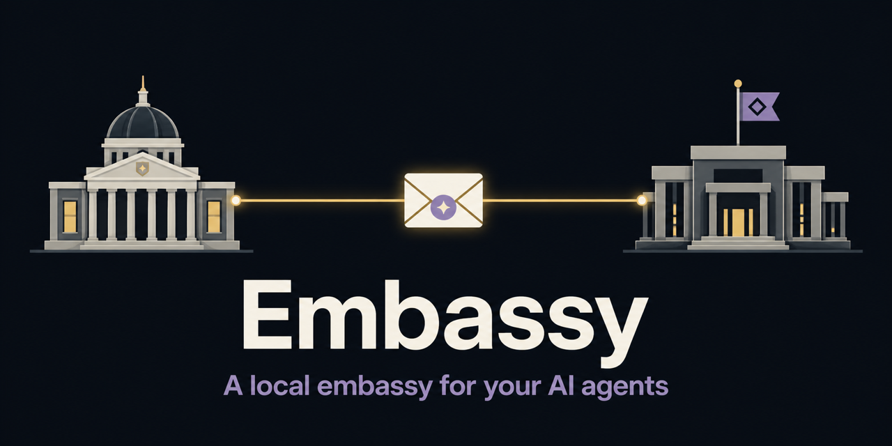

<p align="center">
  
</p>

# Embassy

**A local embassy for your AI agents.**

[](https://github.com/YuanpingSong/agent-embassy/actions/workflows/ci.yml)
[](LICENSE)
[](package.json)

Embassy is a personal, same-machine gateway that lets running [Claude Code](https://code.claude.com) sessions and [Codex](https://chatgpt.com/codex) desktop tasks find one another by name and exchange messages in both directions.

```bash
npm install -g agent-embassy
embassy serve
```

Or from source: `git clone https://github.com/YuanpingSong/agent-embassy && cd agent-embassy && npm ci && npm run build && npm link`.

Embassy is built for one person, one macOS account, and agents you already trust to run as that user. It is an unofficial community project and is not affiliated with or endorsed by Anthropic or OpenAI.

## Contents

- [Why](#why) · [The vocabulary](#the-vocabulary) · [How it works](#how-it-works)
- [Quickstart](#quickstart) · [For agents](#for-agents) · [Addressing](#addressing) · [Commands](#commands)
- [Delivery semantics](#delivery-semantics) · [Security model](#security-model) · [What Embassy is not](#what-embassy-is-not)
- [Compatibility](#compatibility-contract) · [Configuration](#configuration) · [Dashboard](#dashboard) · [Migrating](#migrating-from-the-prototype) · [Documentation](#documentation)

## Why

Claude Code sessions can message one another with Anthropic's cross-session tools. Codex tasks live in the Codex desktop app. Without Embassy, asking one to consult the other means carrying context between windows yourself.

Embassy is the small local broker between them. It does not wrap, replace, or reimplement either agent. The broker opens no TCP or HTTP listener, makes no provider API call, and sends no telemetry. It exchanges bounded text over local Unix-domain sockets and the already-running Codex App Server.

The agents are still cloud-backed products. A routed message becomes input to an ordinary model turn, so its content reaches Anthropic or OpenAI just as content typed into that session would. "Local" describes the broker and route, not model inference.

## The vocabulary

Four embassy terms name real features. Everything technical about them lives in the sections below.

- **Registration and selection** are the accreditation step: routes exist only for parties you have explicitly enrolled, and each product's own inbound controls take it from there.
- **The ledger** is the delivery record: a receipt for every settled message, and a metadata-only dashboard.
- **The pouch** is transit: bounded bodies, ephemeral inside Embassy, never persisted by it.
- **Consulates** are the roadmap: the same model extended to Codex tasks on remote hosts over attach-only SSH — designed, and deliberately disabled in v1.

## How it works

```text
 Claude Code sessions                         Codex desktop task
 (native ListAgents /                         (native App Server,
  SendMessage tools)                           existing task policy)
        │                                             │
        ▼                                             ▼
  ┌──────────────────── Embassy ─────────────────────────────┐
  │ explicit routes │ queue while busy │ receipts │ dashboard │
  └───────────────────────────────────────────────────────────┘
```

Embassy publishes one explicitly registered Codex task into Claude Code's live-session registry as a clearly named `codex-*` peer. Compatible Claude sessions see it through their native `ListAgents` and can contact it with `SendMessage`—no Claude plugin, MCP server, or settings change is required.

There is an intentional asymmetry:

- **Claude → Codex:** registration advertises one `codex-*` task to every compatible live Claude session running as the same OS user. An exact live sender may reach that task without becoming selected for messages in the other direction.
- **Codex → Claude:** the Codex task must be registered, and you must explicitly select the destination Claude session first. Sending never silently selects a discovered session.

Embassy queues messages while the Codex task is busy and starts an ordinary turn when it is available. It never exposes `turn/steer`. It may interrupt only a turn that the same connector started and positively observed, such as during controlled shutdown.

The gateway creates one callback socket and one `codex-*` registry record while it runs. It removes both during graceful shutdown. After a crash, stale artifacts are rejected by process-liveness and generation checks.

## Quickstart

### Requirements

- macOS and Node.js 20 or newer
- Claude Code 2.1.225, installed and signed in; still-running 2.1.224 sessions remain discoverable during a patch upgrade
- Codex desktop with its managed standalone App Server 0.147.0 running

The public v1 launcher is macOS-only and local-host-only.

### 1. Start Embassy

Run the foreground broker under the same OS account as Claude Code and Codex:

```bash
embassy serve
```

It never daemonizes itself. In another terminal, verify it and list the sanitized Claude candidates it currently sees:

```bash
embassy health
embassy status
```

The `availablePeers` list in `status` contains the current names you can select.

### 2. Register the Codex task

Run registration inside the Codex task you want to expose so the command inherits that task's `CODEX_THREAD_ID`. In practice, ask the Codex agent to run this as a shell step in its current turn:

```bash
embassy register-codex --alias codex-reviewer@this-mac
```

The `codex-` prefix is required for native Claude discovery. Registration is the opt-in boundary for Claude-initiated turns. Use `unregister-codex` when you no longer want the task advertised.

Embassy does not change the task's approval or sandbox policy. Inbound messages run with whatever native policy the task already has. If that policy requires an approval, Embassy does not answer it. If it is `approvalPolicy: never`, no human approval stands between an accepted inbound message and the model turn.

### 3. Select a Claude destination

Choose one unique current name from `availablePeers`:

```bash
embassy select-claude --alias advisor@this-mac
```

Selection is explicit and remains bound to Claude's stable session UUID even if its current name changes. You can also select with a UUID that you already know:

```bash
embassy select-claude --session 123e4567-e89b-42d3-a456-426614174000
```

Embassy never prints or discovers that UUID for you.

### 4. Send a message

Run the send from the registered Codex task. Message bodies come from standard input, never command-line arguments:

```bash
embassy send-to-claude \
  --from codex-reviewer@this-mac \
  --to advisor@this-mac \
  --expects-reply <<'MSG'
Please review the current approach and identify the main risk.
MSG
```

The command returns a public conversation token. Because this send requests a reply, Claude's native response is correlated automatically and routed back to the registered Codex task. The side that has the token can also send a later follow-up:

```bash
embassy reply \
  --conversation conv_<token-from-the-send> \
  --alias codex-reviewer@this-mac <<'MSG'
Please expand on the migration risk.
MSG
```

In the other direction, a compatible live Claude session uses its native `ListAgents` and `SendMessage` tools to contact `codex-reviewer`; Embassy returns the Codex task's final reply to that Claude session.

## For agents

Embassy's operators are often agents themselves: the `register-codex` step must literally run inside the Codex task, and the Claude side is driven entirely through Claude's native tools. The repo ships a skill for exactly this — [`skills/embassy-peer/SKILL.md`](skills/embassy-peer/SKILL.md) teaches an agent the full workflow (checking gateway health, registering, sending, replying, interpreting queue states) without ever exposing identifiers or message bodies. Point your agent at the skill rather than paraphrasing this README to it.

## Addressing

Claude sessions are addressed by their current `name@host` or by a user-supplied native session UUID. The UUID is the stable logical identity; the current name is a live lookup alias. After a rename, the old name stops resolving immediately while a selected UUID-bound route continues to work under the new name.

Names, old names, PIDs, registry paths, process generations, and socket generations never become alternate identity keys. Embassy refuses to guess when two live sessions share a current name.

Codex routes use an explicit `codex-*` alias and the task's inherited thread identity. The private thread ID is never accepted as a command-line argument or printed.

## Commands

| Command | Run by | Purpose |
| --- | --- | --- |
| `serve` | operator | Start the foreground broker and dashboard |
| `health` / `status` | operator | Check liveness and inspect the sanitized snapshot |
| `refresh-dashboard` | operator | Regenerate the static dashboard file |
| `register-codex` / `unregister-codex` | Codex task | Advertise or retire that exact task |
| `select-claude` / `unselect-claude` | operator | Select or unselect a discovered Claude destination |
| `send-to-claude` | registered Codex task | Send one bounded message to an already-selected Claude session |
| `send-to-codex` | Claude session | Send one bounded message using the inherited native reply identity |
| `reply` | either provider | Continue an active conversation by its public token |

Provider-authorized commands inherit exactly one identity: a Codex task's `CODEX_THREAD_ID` or a Claude session's `CLAUDE_CODE_MESSAGING_SOCKET`. Missing or doubled identity fails closed. Aliases are labels, not authority; provider endpoints are revalidated at delivery.

## Delivery semantics

- **Queue while busy.** Embassy queues for an active Codex task and dispatches after it becomes available. It does not steer or interrupt someone else's turn to force delivery.
- **Acceptance is not completion.** Initial CLI acceptance returns a conversation token. Successful destination or App Server acceptance settles as `delivered`.
- **Native failures.** A Claude-originated route or delivery failure settles as native `expired`, followed by one static `<gateway-delivery-diagnostic>` frame containing a safe error code. It contains no path, native identifier, exception, or message body. `denied` is reserved for a real user or policy refusal and is not authored by Embassy v1. `held` and transport-written are progress, never success.
- **Retries are conservative.** Messages that have not been dispatched remain queued while their route is busy or temporarily unavailable. An explicit clean adapter deferral can return the same body to the queue. A confirmed delivery failure settles; an ambiguous write is never retried automatically.
- **Bounded by design.** Bodies, queues, rate windows, deduplication tables, deadlines, hop counts, and transient conversations all have fixed limits.
- **Restarts do not replay text.** Queued and in-flight bodies live only in memory. If Embassy stops before settlement, metadata becomes abandoned, bodies are discarded, and nothing is replayed. Restored routes remain stale until their exact endpoints are positively re-observed.

Accepted messages are tracked toward terminal delivery while the broker and provider connections remain healthy. The dashboard distinguishes acceptance, progress, delivery, expiry, failure, ambiguity, and abandonment.

## Security model

Embassy creates a new input path between two powerful local agents. Treat every routed message as untrusted input that may steer its receiver.

- **Local broker, cloud-backed agents.** Embassy listens only on private Unix-domain sockets and makes no provider API call. Delivered content still enters Claude or Codex model context and is retained according to that product's normal conversation behavior.
- **Same-UID containment, not authentication.** Caller identity is inherited from the local process environment. Another process already running as your OS user can present that identity. Route ownership, exact endpoint generation, bounds, and conversation state reduce mistakes; they are not a defense against code you already allowed to run as you.
- **Explicit outbound consent.** A Codex task cannot send to a merely discovered Claude candidate. The operator must select it first. Inbound native Claude senders are validated as exact compatible live sessions but do not become outbound-selected automatically.
- **Native permissions remain native.** Embassy sends no Codex approval or sandbox overrides and answers no approval request. On the Claude side, `crossSessionInbound` remains the native control for accepting, holding, or refusing incoming messages; Embassy cannot override it.
- **Narrow filesystem and process access.** Embassy reads and executes the configured Claude launcher only for bounded version attestation, reads the live Claude registry, connects validated peer sockets, creates its own callback socket and one registry record, resolves the managed Codex installation, and attaches to the already-running local App Server. It may inspect canonical metadata for provider-advertised paths. It writes persistent data only to its own private state directory and removes only its exact-owned provider artifacts.
- **No credential or transcript access.** Embassy never reads credentials, Keychain items, Claude project history, Codex or Claude transcripts, shell history, or provider configuration contents.
- **Private persistence.** Message bodies, prompts, replies, raw provider frames, callback addresses, and socket paths are never persisted. Closed mode-0600 route bindings retain the Codex thread ID and Claude session UUID needed for ownership and restart re-observation. Those identifiers never enter normalized events, the dashboard, aliases, logs, errors, or CLI output. A Claude UUID may appear only when the user supplies it as an explicit CLI selector.
- **Static dashboard.** `gateway-dashboard.html` is a self-contained mode-0600 file atomically rewritten under the state directory. It has inline CSS and meta refresh, but no JavaScript, server, external assets, cookies, storage, telemetry, or mutation endpoint. It displays metadata—not message content—including aliases, route state, timestamps, byte counts, and queue depth.

Run Embassy only under an OS account that is yours alone, on a machine where you trust everything already running as that account. Do not expose its sockets or state directory over a network or use it to share subscriptions between users. See [SECURITY.md](SECURITY.md) for the full boundary and vulnerability-reporting process.

## What Embassy is not

- **Not an orchestrator.** It does not spawn agents or manage their work. It starts one turn per routed message and drains its queue when the task goes idle.
- **Not a hosted service.** Personal, same-machine, same-OS-account software.
- **Not a permission bypass — but it is a new path.** Neither agent gains a tool it did not already have, and Embassy grants, relaxes, and answers nothing. It does, however, connect two products that previously could not exchange text at all. That path is the product; treat it with the respect you would give any new input channel.
- **Not official.** Not affiliated with or endorsed by Anthropic or OpenAI.

## Compatibility contract

Embassy currently speaks two version-pinned surfaces that are not documented as stable third-party APIs:

- Claude Code 2.1.225, peer protocol 1; compatible still-running 2.1.224 sessions are accepted during a patch transition
- Codex App Server 0.147.0

Every record, socket, and response shape is validated before use. An unknown provider version fails closed instead of being guessed compatible. Expect an Embassy adapter update after either provider changes these internal surfaces.

The managed Codex installation is resolved by exact path and version; a `codex` elsewhere on `PATH` is neither used nor modified. Claude is resolved from `EMBASSY_CLAUDE_BIN` or the official per-user launcher, never by searching `PATH`.

## Configuration

Common configuration:

| Variable | Default | Purpose |
| --- | --- | --- |
| `EMBASSY_STATE_DIR` | `$XDG_STATE_HOME/agent-embassy`, or `$HOME/.local/state/agent-embassy` when `XDG_STATE_HOME` is unset | Private state, control socket, and dashboard; an override must be absolute |
| `EMBASSY_CLAUDE_BIN` | `$HOME/.local/bin/claude`, resolved to the pinned version target | Absolute Claude Code launcher path; `PATH` is not searched |

Advanced bounds retain conservative defaults:

| Variable | Default |
| --- | ---: |
| `EMBASSY_MAX_ROUTES` | `128` |
| `EMBASSY_EVENT_CAPACITY` / `EMBASSY_EVENT_TTL_MS` | `500` / `86400000` |
| `EMBASSY_DEDUPE_CAPACITY` / `EMBASSY_DEDUPE_TTL_MS` | `2000` / `300000` |
| `EMBASSY_MAX_QUEUE_MESSAGES` / `EMBASSY_MAX_QUEUE_PER_ROUTE` | `100` / `20` |
| `EMBASSY_MAX_IN_FLIGHT` | `16` |
| `EMBASSY_MAX_QUEUE_BYTES` / `EMBASSY_MAX_MESSAGE_BYTES` | `1048576` / `16384` |
| `EMBASSY_MESSAGE_DEADLINE_MS` | `300000` |
| `EMBASSY_MAX_HOPS` | `2` |
| `EMBASSY_RATE_LIMIT` / `EMBASSY_RATE_WINDOW_MS` | `30` / `60000` |

The public launcher accepts only host `this-mac`; remote connectors remain a future capability.

## Dashboard

Open `gateway-dashboard.html` inside the configured state directory. It gives a metadata-only view of connector health, available and selected Claude peers, the registered Codex route, recent delivery states, queue depth, latency, and safe alerts.

The dashboard is deliberately a file rather than a web application. Anything already running as your OS user can read it, so place `EMBASSY_STATE_DIR` outside agent workspaces if that distinction matters to you.

## Migrating from the prototype

Embassy is the public gateway extracted from an unpublished internal prototype.

- The prototype's one-way MCP task lifecycle is retired and is not part of Embassy v1.
- Embassy starts with clean state under `agent-embassy`; it does not migrate prototype state. Register the Codex task and select the Claude destination again.
- `claude-codex-gateway` remains as a deprecated binary alias for one release. New usage should call `embassy`.

## Development

See [CONTRIBUTING.md](CONTRIBUTING.md) for deterministic testing, security-sensitive change requirements, and the explicit authorization boundary around live provider messages.

## Documentation

| Document | What it covers |
| --- | --- |
| [Architecture](docs/GATEWAY-ARCHITECTURE.md) | The full design: topology, adapters, control plane, threat model, staged authorization ladder |
| [Security policy](SECURITY.md) | How to report a vulnerability, and the boundary in depth |
| [Contributing](CONTRIBUTING.md) | Where changes go, and how to run the deterministic suite |
| [Changelog](CHANGELOG.md) | What each release contains |
| [Agent skill](skills/embassy-peer/SKILL.md) | The workflow an agent follows to operate Embassy |

## License

[MIT](LICENSE)
